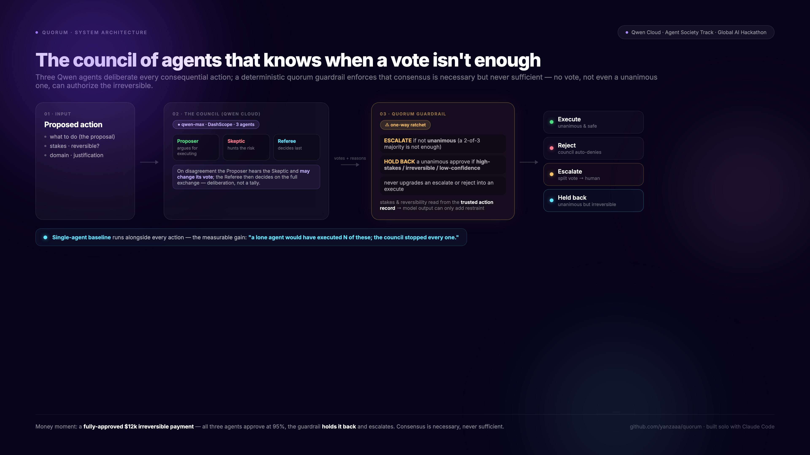
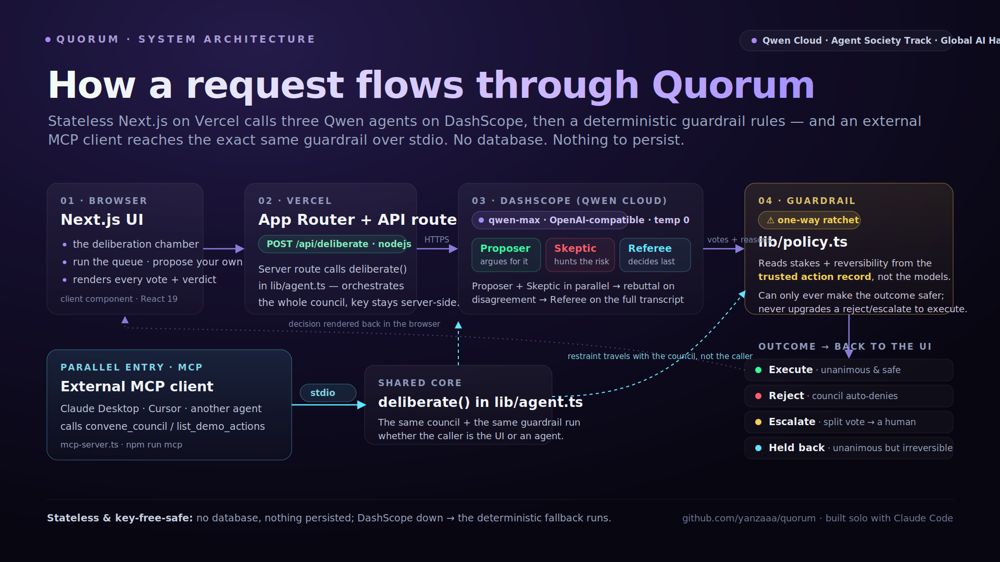

# Quorum: the agent council that knows when a vote isn't enough

> **Global AI Hackathon Series with Qwen Cloud · Track: Agent Society (multi-agent) · built solo with Claude Code.**

Most "multi-agent" demos let a swarm of agents talk themselves into an action. The dangerous failure mode of an agent *society* is **collective overconfidence**: three agents agreeing is not the same as authorization, and a fluent consensus can still be catastrophically wrong about something irreversible.

**Quorum is a council of Qwen agents that deliberates every consequential action, and a deterministic guardrail that refuses to execute without consensus and refuses to let any consensus authorize the irreversible.** It executes the clearly-safe, auto-denies the clearly-bad, and escalates the rest to a human.



*Above: the **decision logic** — how three votes become one guarded outcome. Below: the **system architecture** — how a request actually flows through the stack.*



## What it does

For each proposed action, three Qwen agents each cast an independent vote:

- **Proposer** argues the strongest good-faith case *for* executing.
- **Skeptic** hunts for what could go wrong: irreversibility, missing authorization, fraud, disproportionate stakes.
- **Referee** weighs both and casts a deciding vote.

Then a **deterministic quorum guardrail** turns the three votes into one outcome:

- **execute** — the council *unanimously* approves AND the action is safe enough to run autonomously,
- **reject** — the council agrees it should not happen (auto-denied, no human needed),
- **escalate** — the agents disagree, or the action is high-stakes / irreversible and no vote can authorize it.

Only the escalations ever reach a person — the rest of the queue resolves without waiting on one.

## Why consensus is never sufficient

The votes are advisory. Trust comes from a **deterministic guardrail** (`lib/policy.ts` + `applyQuorum` in `lib/agent.ts`) layered on top of the council. It is a **one-way ratchet**: it can only ever make the outcome *safer*.

- It **never executes without unanimity** — even a 2-of-3 majority on a perfectly safe action is escalated, not run.
- It **never lets unanimity override caution** — even a 3-of-3 approval is **held back** when the action is high-stakes, irreversible, below the confidence floor, or carries a blocking risk flag.
- It **never turns** an escalate or reject **into** an execute.

Stakes and reversibility are read from the **trusted action record**, not from anything the models said, so a confidently-wrong agent cannot talk the guardrail into running an irreversible action.

**The money moment:** a $12,000 contractor payment that two managers and finance have *already approved*. All three agents vote to execute (95% each). The guardrail **holds it back anyway** and escalates: a fully-authorized, unanimous council still does not get to pull an irreversible trigger without a human. The UI shows it: *"All 3 agents voted to approve, but the quorum guardrail held the action back."*

## The society is load-bearing (measured against a single agent)

Two things make the *multi-agent* layer do real work, not just dress up a guardrail:

- **Deliberation, not arithmetic.** The Proposer and Skeptic argue independently; the **Referee then votes *after* reading both of their arguments** (`askReferee` in `lib/agent.ts`). The deciding vote is a function of the council's exchange, so the agents can move the outcome — e.g. a low-stakes, reversible $30 refund that a stakes-only guardrail would wave straight through is **caught by the Skeptic** once it sees an 11-refunds-this-month abuse pattern.
- **A single-agent baseline runs alongside every action, and the gain is measured.** One lone, oversight-free Qwen agent decides whether it would just execute the action. The gain over that baseline is committed as a reproducible artifact — [`public/benchmark.json`](public/benchmark.json), regenerated with `npx tsx scripts/aggregate.ts`: **on the 7-action demo queue, the lone agent executes 6 of 7 — including the $50,000 invoice-fraud wire and the irreversible $12,000 payment — while the council executes 2, auto-denies 3, and escalates 2, stopping all 4 of the lone agent's unsafe executions ($62,030 of priced exposure, plus an unpriced 40% recurring discount) with a human touching only 2 of 7 actions.** (Qwen is a strong model, so a single agent already balks at outright data destruction on its own; the council's measurable edge shows up precisely on the fraudulent, the contested, and the irreversible, which is where it should.) That gain is a concrete **efficiency win, not just a safety stat**: each stopped execution is a mistaken wire, a rewarded abuse pattern, or an unauthorized discount the team would otherwise have to detect, reverse, and reconcile after the fact — cost and rework the council avoids up front, at a price of 4–5 qwen-max calls per verdict vs. the lone agent's 1.

## How it's built

- **Qwen (`qwen-max`) on Qwen Cloud**, called through the OpenAI-compatible Alibaba Cloud DashScope endpoint with structured JSON and `temperature: 0`. Proof: [`lib/qwen.ts`](lib/qwen.ts) + the three live agent calls in [`lib/agent.ts`](lib/agent.ts).
- **A real society of agents:** the Proposer and Skeptic vote independently, then the Referee casts the deciding vote *after weighing both arguments* — a deliberation, not a parallel poll. A separate lone-agent baseline runs alongside for comparison.
- **The quorum guardrail** (`lib/policy.ts`) is the deterministic safety net that guarantees the invariants above.
- **Next.js (App Router) + TypeScript + Tailwind**, deployed on Vercel. The UI shows every agent's vote, confidence, and reasoning, plus the held-back escalations.
- **No key, no crash:** without a `DASHSCOPE_API_KEY` the same deliberation logic runs on a deterministic engine, so the demo keeps working even when the API is unreachable.

## Tests

The safety property is unit-tested: **25 Vitest tests** (`npm test`) pin the quorum invariants — no execution without unanimity; a split vote escalates; a unanimous approval of a high-stakes, irreversible, low-confidence, or flagged action is **held back** (including when the models report *zero* risk flags, proving model output can't relax the gate); a unanimous rejection is auto-denied; an escalate/reject is never upgraded to an execute (the one-way ratchet); the low-stakes abuse pattern is caught by agent reasoning; the single-agent baseline is measured; and the model-parsing seam fails closed on malformed output. See [`tests/quorum.test.ts`](tests/quorum.test.ts) and [`tests/deliberate.test.ts`](tests/deliberate.test.ts).

## Use it as an MCP server

The council is exposed to any MCP client (Claude Desktop, Cursor, or another agent) over stdio — run `npm run mcp` ([`mcp-server.ts`](mcp-server.ts)). Two tools:

- `convene_council` — submit a consequential action; the three agents deliberate and the guardrail returns execute / reject / escalate, with every vote, the held-back flag, and the single-agent baseline.
- `list_demo_actions` — list the built-in demo queue.

The point: an *agent society* can consult Quorum before acting. Another agent submitting "wire $50k from an emailed invoice" gets it **rejected by the council** — and even on an action all three approve, the guardrail still won't let an external caller execute the irreversible. The restraint travels with the council, not the caller.

## Run it locally

```bash
npm install
cp .env.example .env     # DASHSCOPE_API_KEY from the Alibaba Cloud console
npm run dev              # http://localhost:3000
```

Hit **Run the council on the queue** and watch the deliberations land. A valid key convenes three live Qwen agents per action; with no key the deterministic engine plays out the same votes, rebuttals, and hold-backs.

## What's next

- Weighted / domain-expert councils (e.g. a legal agent whose veto is binding for legal-risk actions).
- A confidence-calibrated quorum size: more agents convened as stakes rise.
- A one-click human-approval path for escalated actions, with the council's full transcript attached.

Built solo with **Claude Code**.
